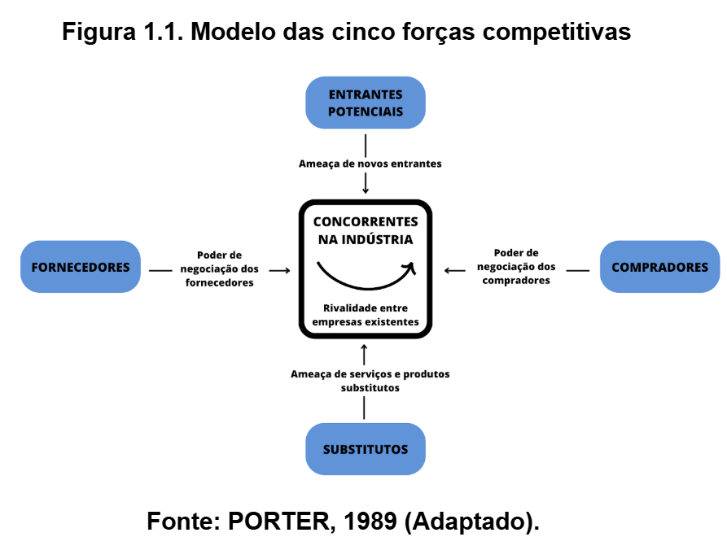

# SISTEMAS INTEGRADOS DE GESTÃO (SIG)

Este local inclui todos os pontos relevantes desse assunto, desde conceitos e fundamentos do SIG.

---

Um SIG (Sistema Integrado de Gestão) é um software que conecta todos os setores de uma empresa, facilitando o compartilhamento de informações e melhorando a organização, a agilidade e a tomada de decisões.
Um SIG pode ser composto por diversos módulos integrados entre si, possuindo um Banco de Dados central.

---
## Vantagens do SIG
Os Sistemas Integrados de Gestão apresentam diversas características, entre as quais podem ser citadas (TURBAN et al, 2007, LAUDON, LAUDON, 1999a, 1999b):

a) Reúnem os processos de negócios essenciais da empresa em um único SI;

b) Permitem que a informação flua livremente para toda a organização, melhorando a coordenação, a eficiência e a tomada de decisão;

c) Geralmente são constituídos por um conjunto de módulos de software integrado e um SGBD – Sistema Gerenciador de Banco de Dados central comum, que coleta e disponibiliza dados;

d) Podem atuar em praticamente todas as atividades internas de uma organização;

e) Ampla disponibilidade dos dados para todos os processos organizacionais;

f) Podem acarretar significativas mudanças nos processos organizacionais;

g) Influenciam no modelo e estrutura organizacional.

Os SIGs representam um importante fator para apoiar o planejamento estratégico de uma organização, e representa um fator de apoio para a obtenção de uma vantagem competitiva sobre a concorrência. Podem também permitir respostas mais rápidas às mudanças competitivas ambientais.

---

## SISTEMA DE INFORMAÇÃO ESTRÁTEGICO (SIE)

O SIE pode ser entendido como aquele que sistema de informação que possibilitam a mudança das metas organizacionais, as suas operações e serviços que entregam ao mercado e os relacionamentos ambientais das organizações, ajudando a manter a vantagem competitiva sobre a concorrência.

### Características do SIE

a) Podem mudar o negócio da empresa;

b) Podem ser utilizados em qualquer ponto da organização;

c) Podem alterar profundamente o modo como as firmas conduzem os seus negócios ou mesmo o próprio negócio da empresa.

d) Podem integrar e sintetizar dados obtidos a partir de fontes internas e externas à organização, utilizando ferramentas de análise e comparação complexas, simulação e outras facilidades para a tomada de decisão da cúpula estratégica da organização.

As organizações buscam desenvolver usos particulares da Informação e de seus Sistemas de Informação que possam representar um diferencial competitivo. O Modelo das Cinco Forças Competitivas de Porter (PORTER, 1989) apresenta um conjunto de forças cujo combinação permitiria que uma organização avaliasse a sua capacidade competitiva dentro do segmento em que atua, conforme exposto na Figura 1.1.

---

---

| Força de Porter     | Como a TI pode ajudar?                      |
| ------------------- | ------------------------------------------- |
| Concorrência direta | Inovação, automação, análise de dados       |
| Novos entrantes     | Criar barreiras tecnológicas                |
| Fornecedores        | Negociação via sistemas inteligentes        |
| Clientes            | Personalização e fidelização com tecnologia |
| Substitutos         | Inovação contínua e adaptação               |

vantagem competitiva é resultado da combinação das cinco forças competitivas, a saber: a) ameaça de novos concorrentes (novos entrantes); b) ameaça de novos produtos ou serviços (substitutos); c) rivalidade entre as empresas concorrentes; c) poder de barganha dos clientes e, e) poder de barganha dos fornecedores.

## 3 Estratégias Competitivas de Porter (1989)

### Baixo Custo
→ A empresa vende mais barato que os concorrentes, mantendo qualidade aceitável, porque tem custos de produção menores.

Liderança em Baixo Custo ou produtos de Baixo Custo, podem ser observados os seguintes fatores:

• TI ajuda a reduzir custos: A tecnologia da informação pode ajudar a empresa a gastar menos para funcionar e vender produtos com preços mais baixos.

• Produção e atendimento maiores sem aumentar custos: Com TI, as empresas podem produzir e atender mais clientes sem gastar muito a mais.

• Gestão compartilhada de estoque: Grandes lojas estão trabalhando junto com seus fornecedores para controlar melhor o estoque.

• Reposição diária pelos fornecedores: Os fornecedores entregam produtos todo dia, assim a loja precisa guardar menos mercadoria, economizando espaço e evitando perdas.

### Diferenciação
→ A empresa oferece algo único ou especial que faz o cliente pagar mais caro (ex: marca, design, inovação).

Sobre a diferenciação de produtos pode-se observar:

• A TI tem sido utilizada para facilitar a criação de novos e diferenciados produtos e serviços em todos os setores econômicos;

• A TI tem o caráter de tornar mais conveniente o uso de produtos e serviços que sejam significativos e criem valor para o cliente, como os app financeiros;

• A TI permite, cada vez mais, a criação de serviços e produtos que se ajustem a especificações precisas de clientes individuais;

• A TI permite a customização em massa cada vez mais individualizada.

### Foco
→ A empresa atende um público ou nicho específico, usando baixo custo ou diferenciação, mas focando em um segmento restrito.

TI ajuda a focar em um público específico:

• A tecnologia pode ser usada para atender um grupo de clientes bem definido melhor do que os concorrentes.

• Sistemas de Informação (como os SIGs) analisam clientes:
Eles ajudam a entender o que os clientes gostam, compram e preferem, para a empresa fazer ofertas mais certeiras.

• TI ajuda a vender mais para os mesmos clientes:
Com sistemas integrados, dá pra oferecer novos produtos e serviços para quem já é cliente, sem gastar muito para conquistar outros.

